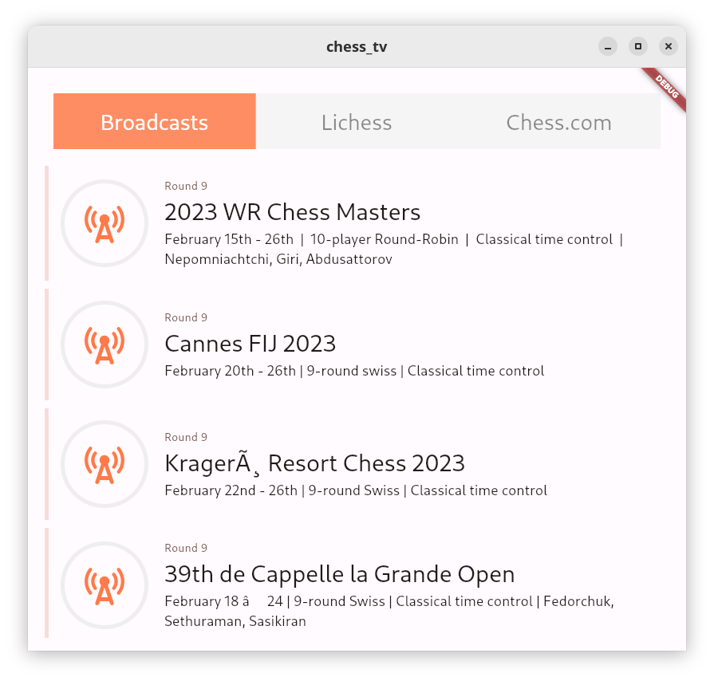
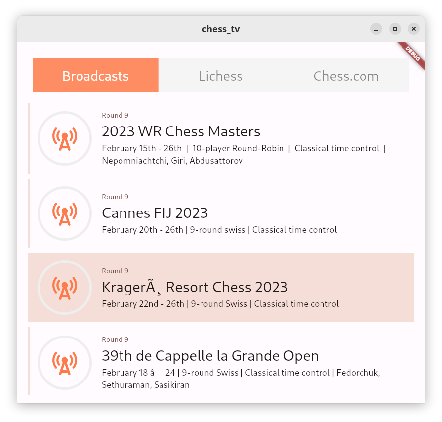
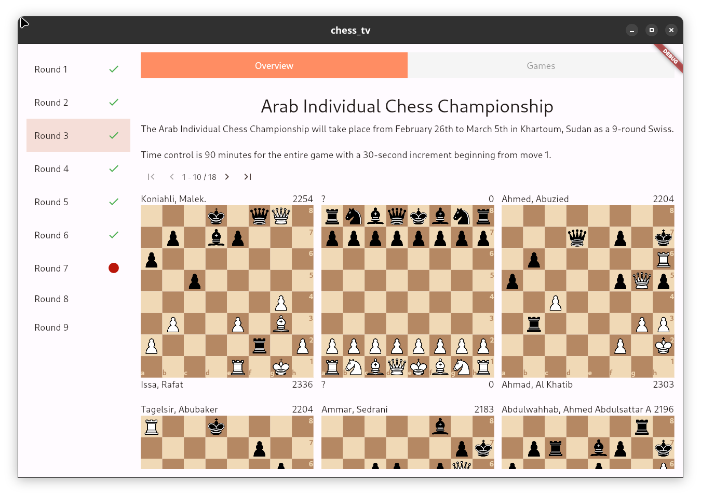

# Table of Contents

1.  [Introduction](#org5268fdd)
2.  [Features](#org548d21e)
3.  [Architecture](#org91ebfe6)
4.  [Frontend](#orge1c5be4)
    1.  [Libraries](#org9435740)
5.  [Screenshots](#org157a5b1)

# Introduction

Chess TV, a revolutionary new app for chess enthusiasts everywhere. With Chess TV, you can now stream games and watch the chessboards from one central location, making it easier than ever to stay up-to-date on the latest games and strategies.  

Features:  
    Live streaming of chess games  
    Ability to watch games in a mini-window that is always on top of other programs  
    Mini-window is semi-transparent and can be placed in a corner of the screen, making it convenient to watch while working on other tasks  
    Comprehensive database of past games, allowing users to easily access and review past matches  
    Interactive game analysis, where users can make moves and see the potential consequences in real-time  
    In-app discussion forums where chess enthusiasts can share their thoughts and strategies  
    Ability to save and organize games of interest for later viewing  

Chess TV is the ultimate tool for chess fans looking to stay on top of the latest games and improve their own play. So why wait? Start streaming games today and take your chess experience to the next level!  

# Features

-   Sources  
    -   [X] Broadcast
    -   [ ] Lichess TV
    -   [ ] Chess.com
-   [ ] Have Picture-in-Picture support

# Architecture

The project makes use of the "clean" architecture.  
it consists of 4 layers:  

-   data providers
-   repositories
-   domain
-   blocs
-   UI

# Frontend

## Libraries

some of these haven't been used yet  

-   **bloc:** for BLoC state management
-   **flutterbloc:** state management
-   **bloctest:** for testing bloc
-   **test:** for testing
-   **mix:** for styling. avoids lots of nesting  
    <https://www.fluttermix.com/>
-   **windowmanager:** helpful functions for manipulating the application window  
    <https://pub.dev/packages/window_manager/>
-   **<https://pub.dev/packages/glass/example>:** might use for glasmorphic effect
-   **desktopmultiwindow:** for multiple windows on desktop  
    <https://pub.dev/packages/desktop_multi_window>
-   **flutterchessground:** chessboard (lichess project)  
    <https://github.com/lichess-org/flutter-chessground>
-   **flutterchessboard:**   
    <https://pub.dev/packages/flutter_chess_board>
-   **tabcontainer:** for tabs  
    <https://pub.dev/packages/tab_container>  
    see <https://fluttergems.dev/tab/> for more options

# Screenshots

  

  

  

  

